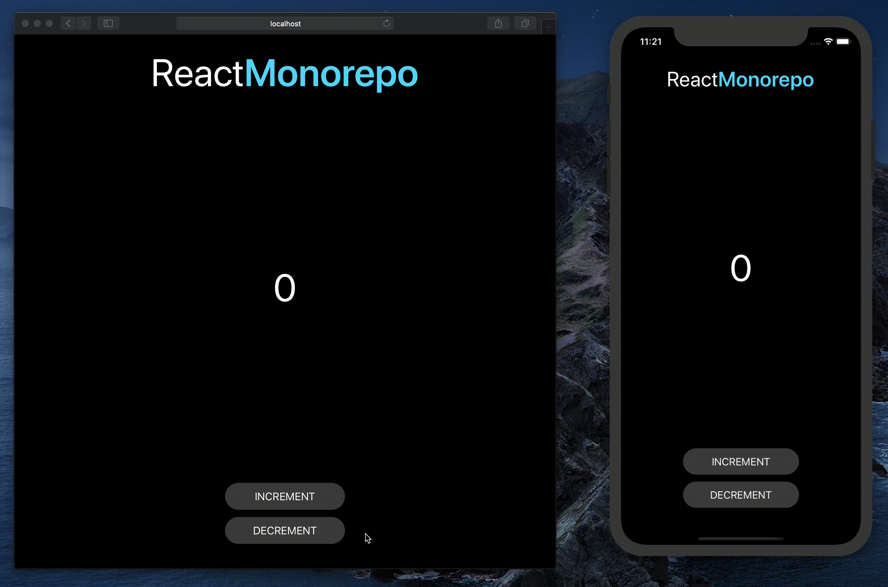

# React Monorepo

a simple monorepo setup for `react` & `react-native` using `yarn workspaces`.



## Getting Started

```sh
# root folder
yarn

# to run native
cd packages/native
yarn ios
yarn android

# to run web
cd packages/web
yarn start
```

## Acknowledgement

This repository made possible by the efforts of the amazing community ❤️ [Follow symlinks? #1](https://github.com/facebook/metro/issues/1)

## Contributing

Pull requests are welcome. For major changes, please open an issue first to discuss what you would like to change.

Please make sure to update tests as appropriate.

## License

[MIT](https://choosealicense.com/licenses/mit/)
